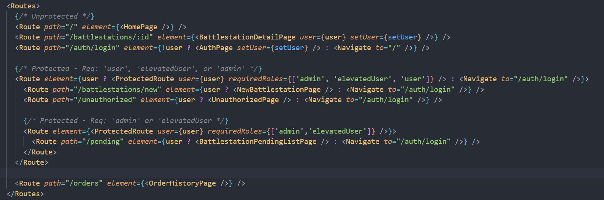
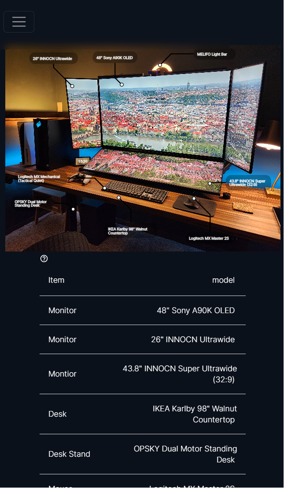

# Aesthetic Setups

  

## Description
 Application that allows users to easily identify and save items in posts from r/battlestations. The app streamlines the process of finding specific items in the comments section of a post, making it easier for users to discover and purchase the products they're interested in. With Aesthetic Setups, users can submit posts from r/battlestations and tag specific items, saving them to a database for easy reference.

## Features
### Custom Middleware to check user privileges
> Performs a server-side check of a user's credentials and roles for actions that require higher-level permissions, such as modifying user settings. If the check fails, the user is denied access and an error is displayed.

### Protected Routes
> Uses similar logic to the previous feature, but this prevents user's from accessing client side routes. If a user tries to access a protected URL without the proper privileges, an unauthorized page will be displayed. 

  

### JWT-Authentication & Authorization
> Another layer of security to verify the user's identity and roles

### Guest account with higher-level permissions
>  Provides users with restricted access to the site, allowing them to explore select pages and perform certain actions that normally require elevated privileges. However, access to sensitive or restricted areas is restricted to ensure the security and integrity of the site.

### Image Labeler built with D3 and visx
> Using D3 and Airbnb's visx library, I implemented an image labeler that lets the user add (labels, tags, annotations, etc.,) for images in any format or size. With support for responsive design, it ensures that the text, position, and size of each tag remain properly scaled. The storing and retrieval methods allow each tag to be modified and displayed correctly regardless of the device or viewport used for their creation.

  

  

## Built with
MongoDB, Express, React, NodeJS, D3, Python, Bootstrap, MaterialUI, Cloudinary

## Next Steps
- [x] Protect routes on back end

- [x] Protect routes on front end

- [x] Add user permissions

- [x] create guest account 

- [x] Add media hosting service

- [x] Add tags to picture that are linked to items in a table

- [x] Design for mobile

- [ ] Refactor tokens to be stored in cookies ( localstorage -> cookie)

- [ ] Allow authors of original content submit a request for the post to be taken down

- [ ] Image labeler tool to create bounding boxes for ML model

- [ ] Train ML model to identify items in pictures
