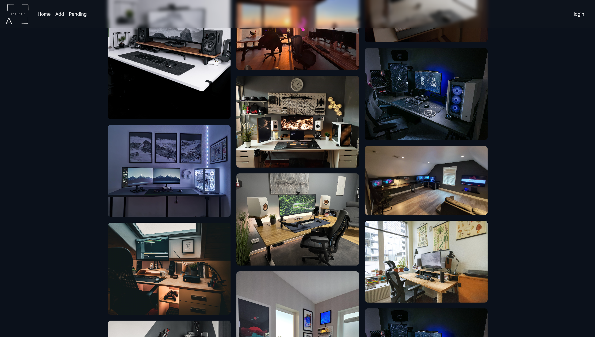

# Aesthetic Setups
>  Users can draw inspiration for their own desk setups and be able to easily identify the items of other users.

## Description
> Application that allows users to easily identify and save items in posts from r/battlestations. The app streamlines the process of finding specific items in the comments section of a post, making it easier for users to discover and purchase the products they're interested in. With Aesthetic Setups, users can submit posts from r/battlestations and tag specific items, saving them to a database for easy reference.

> Using The Python Reddit API Wrapper(https://praw.readthedocs.io/en/stable/), a script scrapes the data of the subreddit r/battlestations

{:height="50%" width="50%"}

## Built with
MongoDB, Express, React, NodeJS, Python, Bootstrap, MaterialUI, Cloudinary

## Next Steps
- [x] Protect routes on back end

- [x] Protect routes on front end

- [x] Add user permissions

- [x] create guest account 

- [ ] Refactor tokens to be stored in cookies ( localstorage -> cookie)

- [x] Add media hosting service

- [x] Add tags to picture that are linked to items in a table

- [x] Design for mobile

- [ ] Train ML model to identify items in pictures
